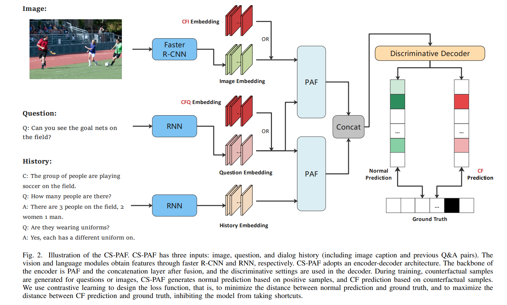
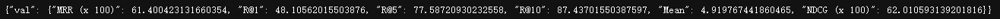
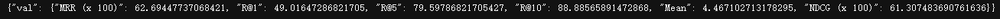
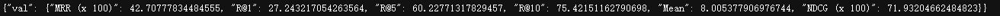
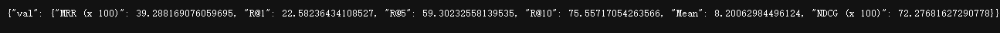
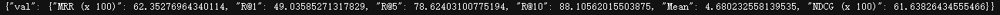
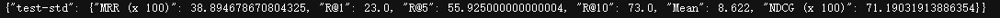

## CS-PAF

<div align=center></div>

## Credits
This repository is build upon [*visdial_conv*](https://github.com/shubhamagarwal92/visdial_conv) *(Agarwal et al.)*, we thank the researchers for providing the code.

## Environment Configuration
```shell
conda create -n cspaf python=3.7
pip install -r requirements.txt
```
```shell
python -c "import nltk; nltk.download('all')"
```

## Data Preparation

|        FileName         |                        Download Link                         |                            Source                            |
| :---------------------: | :----------------------------------------------------------: | :----------------------------------------------------------: |
| image_features_train_h5 | https://drive.google.com/open?id=1eC80EMMEdZvWsKIl3YlEFpY4XHlvN9h8 | provided by repository *[visdial-principles](https://github.com/simpleshinobu/visdial-principles/blob/master/README.md) (Qi et al.)* |
|  image_features_val_h5  | https://drive.google.com/open?id=1_QoH-lbRCwPrcuiwVNjhW1yMxhqiLclB | provided by repository *[visdial-principles](https://github.com/simpleshinobu/visdial-principles/blob/master/README.md) (Qi et al.)* |
| image_features_test_h5  | https://drive.google.com/open?id=1hyMCJLXAyaNHmnoRZM8eF3fNia49oHLl | provided by repository *[visdial-principles](https://github.com/simpleshinobu/visdial-principles/blob/master/README.md) (Qi et al.)* |
|       train_json        | https://www.dropbox.com/s/ix8keeudqrd8hn8/visdial_1.0_train.zip?dl=0 | provided by [*official website*](https://visualdialog.org/data) |
|        val_json         | https://www.dropbox.com/s/ibs3a0zhw74zisc/visdial_1.0_val.zip?dl=0 | provided by [*official website*](https://visualdialog.org/data) |
|        test_json        | https://www.dropbox.com/s/o7mucbre2zm7i5n/visdial_1.0_test.zip?dl=0 | provided by [*official website*](https://visualdialog.org/data) |
|    train_dense_json     | https://www.dropbox.com/s/1ajjfpepzyt3q4m/visdial_1.0_train_dense_sample.json?dl=0 | provided by [*official website*](https://visualdialog.org/data) |
|     val_dense_json      | https://www.dropbox.com/s/3knyk09ko4xekmc/visdial_1.0_val_dense_annotations.json?dl=0 | provided by [*official website*](https://visualdialog.org/data) |
|    word_counts_json     | https://drive.google.com/open?id=1zL8P5LnPzRbfaPxJXvFVGBlS7SumOB_g | provided by repository *[visdial-principles](https://github.com/simpleshinobu/visdial-principles/blob/master/README.md) (Qi et al.)* |
|        glove_npy        | https://drive.google.com/open?id=1y4oSqAwgu2gIcyuF5ZuMuNZ-c-89NGuJ | provided by repository *[visdial-principles](https://github.com/simpleshinobu/visdial-principles/blob/master/README.md) (Qi et al.)* |

## Train or Finetune
```shell
bash -i scripts/cap_hist_early_fusion_disc_train.sh
```
The training logs and checkpoints will be saved in directory exps/exp_name.

## Evaluate
```shell
bash -i scripts/cap_hist_early_fusion_disc_eval.sh
```
The training logs and checkpoints will be saved in directory exps/exp_name.
If we want to get the results generated by [EvalAI](https://eval.ai/web/challenges/challenge-page/518/submission), we can submit the file exps/exp_name/ranks.json. 

## Results

|        Model        |           Result            | Split | Finetune |
| :-----------------: |:---------------------------:| :-----------------: | :-----------------: |
| CS-PAF-68-CFQ(1,-1) |  | val | no |
| CS-PAF-68-CFI(5,-1) |  | val | no |
| CS-PAF-24-CFQ(10,-1) |  | val | yes |
| CS-PAF-68-CFI(5,-1) |  | val | yes |
| CS-PAF |  | test | no |
| CS-PAF |  | test | yes |

